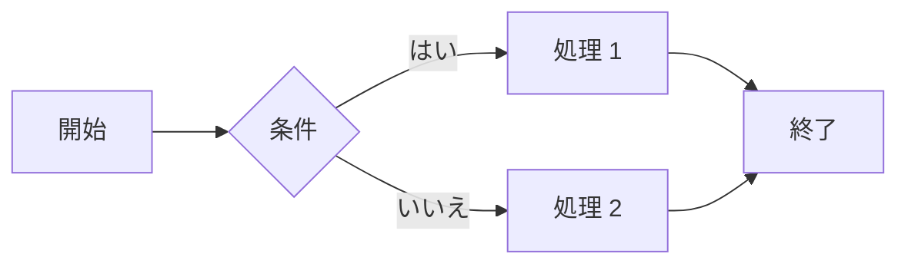
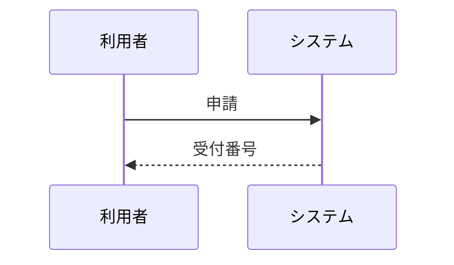

# 1. 図の確認

## 1.1 フローチャート


```mermaid
flowchart LR
  A[開始] --> B{条件}
  B -->|はい| C[処理 1]
  B -->|いいえ| D[処理 2]
  C --> E[終了]
  D --> E
```

## 1.2 シーケンス図


```mermaid
sequenceDiagram
  participant U as 利用者
  participant S as システム
  U->>S: 申請
  S-->>U: 受付番号
```

# 2. 図にできない場合

## 2.1 記法の誤り

```mermaid
flowchart LR
  A --> ]]] 壊れた記法
```

## 2.2 通常のコードブロック

```bash
echo "mermaid ではないので、そのままコードブロック"
```
